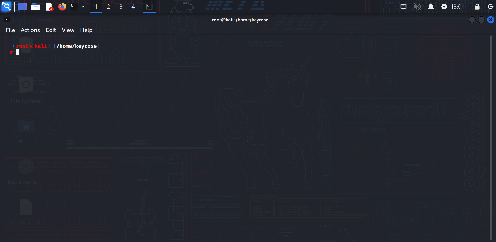
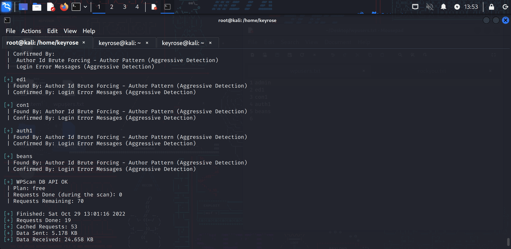

# Project 7 - WordPress Pen Testing

Time spent: **X** hours spent in total

> Objective: Find, analyze, recreate, and document **five vulnerabilities** affecting an old version of WordPress

## Pen Testing Report

### 1. User Account Enumeration

- [ ] Summary:    
  - Vulnerability types: Enumerating Users
  - Tested in version: 4.2
  - Tools/Resources Used:   https://www.kali.org/tools/wpscan    password list: rockyou.txt
  - Techniques: BruteForce, Dictionary Attack, Credential Stuffing
  - Preventative Action: Password Complexity, Multi-Factor Authentication (MFA), Password Manager, Account Lockout Policy
  - Commands used: 
  sudo gunzip /usr/share/wordlists/rockyou.txt.gz (extract and move for ease of use)
    wpscan --url http://wpdistillery.vm (Reconnasissance)
    wpscan --url http://wpdistillery.vm --enumerate u (Finding Usernames)
    wpscan --url http://wpdistillery.vm -U ~/Desktop/wpusers.txt -P ~/Desktop/rockyou.txt (BruteForce Attack)
  

- [ ] Walkthrough:

The Damage

- [ ] Steps to recreate: 
- [ ] Affected source code:
  - [Link 1](https://core.trac.wordpress.org/browser/tags/version/src/source_file.php)
  
### 2. (Required) Vulnerability Name or ID

- [ ] Summary: 
  - Vulnerability types:
  - Tested in version:
  - Fixed in version: 
- [ ] GIF Walkthrough: 
- [ ] Steps to recreate: 
- [ ] Affected source code:
  - [Link 1](https://core.trac.wordpress.org/browser/tags/version/src/source_file.php)

### 3. (Required) Vulnerability Name or ID

- [ ] Summary: 
  - Vulnerability types:
  - Tested in version:
  - Fixed in version: 
- [ ] GIF Walkthrough: 
- [ ] Steps to recreate: 
- [ ] Affected source code:
  - [Link 1](https://core.trac.wordpress.org/browser/tags/version/src/source_file.php)

### 4. (Optional) Vulnerability Name or ID

- [ ] Summary: 
  - Vulnerability types:
  - Tested in version:
  - Fixed in version: 
- [ ] GIF Walkthrough: 
- [ ] Steps to recreate: 
- [ ] Affected source code:
  - [Link 1](https://core.trac.wordpress.org/browser/tags/version/src/source_file.php)

### 5. (Optional) Vulnerability Name or ID

- [ ] Summary: 
  - Vulnerability types:
  - Tested in version:
  - Fixed in version: 
- [ ] GIF Walkthrough: 
- [ ] Steps to recreate: 
- [ ] Affected source code:
  - [Link 1](https://core.trac.wordpress.org/browser/tags/version/src/source_file.php) 

## Assets

List any additional assets, such as scripts or files

## Resources

- [WordPress Source Browser](https://core.trac.wordpress.org/browser/)
- [WordPress Developer Reference](https://developer.wordpress.org/reference/)

GIFs created with  ...

[ScreenToGif](https://www.screentogif.com/) for Windows

## Notes

Describe any challenges encountered while doing the work

## License

    Copyright [yyyy] [name of copyright owner]

    Licensed under the Apache License, Version 2.0 (the "License");
    you may not use this file except in compliance with the License.
    You may obtain a copy of the License at

        http://www.apache.org/licenses/LICENSE-2.0

    Unless required by applicable law or agreed to in writing, software
    distributed under the License is distributed on an "AS IS" BASIS,
    WITHOUT WARRANTIES OR CONDITIONS OF ANY KIND, either express or implied.
    See the License for the specific language governing permissions and
    limitations under the License.
