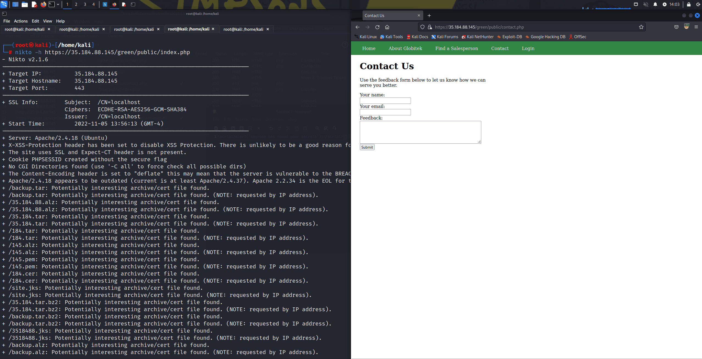
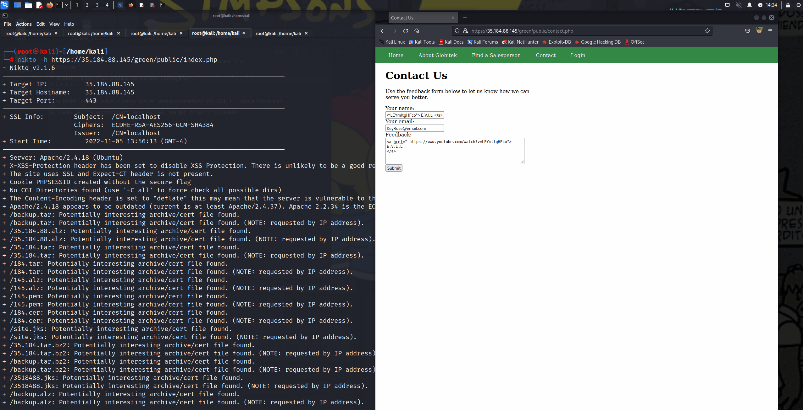

# Pen Testing Live Targets

Time spent: **6** hours spent in total

> Objective: Identify vulnerabilities in three different versions of the Globitek website: blue, green, and red.

The six possible exploits are:

* Username Enumeration
* Insecure Direct Object Reference (IDOR)
* SQL Injection (SQLi)
* Cross-Site Scripting (XSS)
* Cross-Site Request Forgery (CSRF)
* Session Hijacking/Fixation

Each color is vulnerable to only 2 of the 6 possible exploits. First discover which color has the specific vulnerability, then write a short description of how to exploit it, and finally demonstrate it using screenshots compiled into a GIF.

## Blue

Vulnerability #1: Session Hijacking

Description:
 
 
Using BurpSuite, capture the PHP Session ID of an authenticated User. Doing so, we change our session ID to matach theirs via PHP script on a different web browser . Resulting to a successful hijack, bypassing authentication.
 
 
You Got Jacked!?!

## Green

Vulnerability #1: User Enumeration

Description:
 
 
Error messages should not hint at a possible correct answer. Noticed the difference between a non existant user versus an existing one? The error message turns bold! This is just half of the work completed for an adversery to stage an attack. 
 
 
Wait a minute Your not suppose to tell me that

 
Vulnerability #2: Cross-Site Scripting

Description:
 
 
Our Target has a feedback form. Lets try a stored XXS attack. Its like a sring trap, a user need to step on it. The first trap is a simple alert indicating we were successful. Lets try something more devious like directing a user to a new URL. 
 
 
Innocent Vandalism ?

 
Lets try something more devious
  https://m.youtube.com/watch?v=7ewZSjKaOc8&feature=youtu.be

## Red

Vulnerability #1: InSecure Direct Object Reference
 
 
Description: Check out the URL, objects from the sales persons roster are identified by id numbers. Lets try our own to see where this leads. You might find some secrets...  
 
 
Hey i found your secrets! 

## Notes

I used nikto to scan the targets url for each and it pulled alot of information...it led me down a rabbit hole where I was unable to successfuly bare any fruit. I attempted to brute force my way in for the username jmonroe99 with burpsuite and rockyou.txt. No luck here either due to time constrants. 
