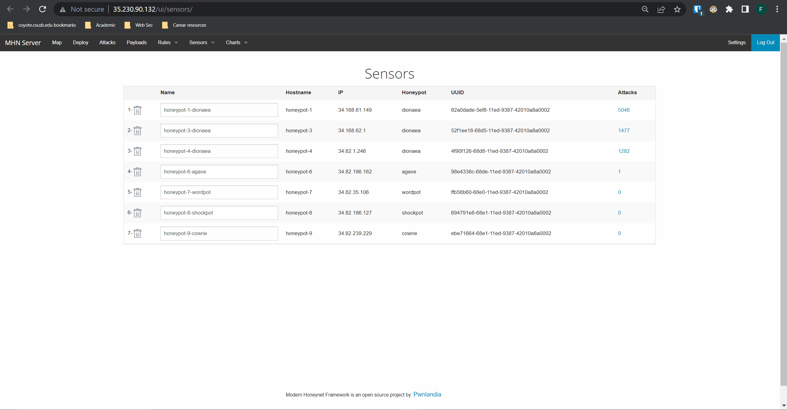

# Honeypot Assignment

**Time spent:** **10** hours spent in total

### MHN-Admin Deployment

**Summary:** Lets use Google Cloud Platform to make Virtual Machines to Host and manage our Honeypot, for safety and educational purposes.
 
 
Safety First
 
 

### Dionaea Honeypot Deployment

**Summary:** Dionaea is our live bait, its pretending to be vulnerable host. This is what lures in malicious actors to execute malicious attacks. While our honeypot is being attacked... we are collecting information about our attacker. This is key for our identifying threat actors and their methods.
 
Friend or Foe
 
 

### Database Backup 

**Summary:** Lets save our data... time for a back up. The json file will contain vital information for our security research such as who what where and when of our logged attacks.

### Deploying Additional Honeypot(s)

#### X Honeypot

**Summary:** Lets try some more lures.Its not a bad idea to cast a variety of baits to get a bite....Not much luck with other honeypots. Whats dionaea secret?

 
 
Does this count as blue team phishing ?
 

### Malware Capture and Identification 

#### WannaCry Malware

**Summary:** Hey looks like dionaea found something. After some poking around seems like WannaCry is still active. Its ransomware from 2017, kinda spooky. https://www.virustotal.com/gui/home/search  

MD5 Hash1: 0ab9a60a55cb40fc338e8f4988feee2f
 
MD5 Hash2: b03cce3bffc2d0b63218cdccedf9acf1
 
MD5 Hash3: 541244c6529f99813eae1f884512a978
 

 
Yes I want to cry

## Notes
